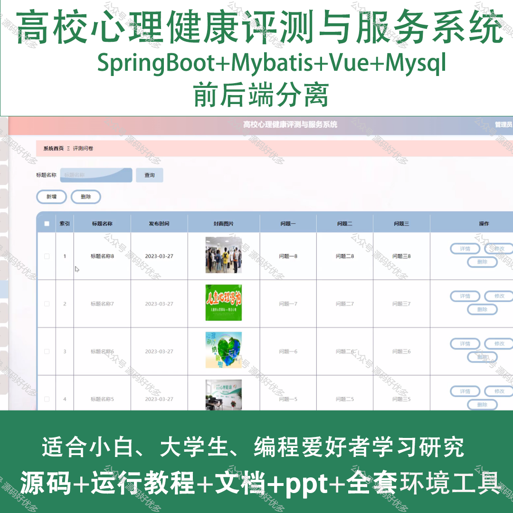
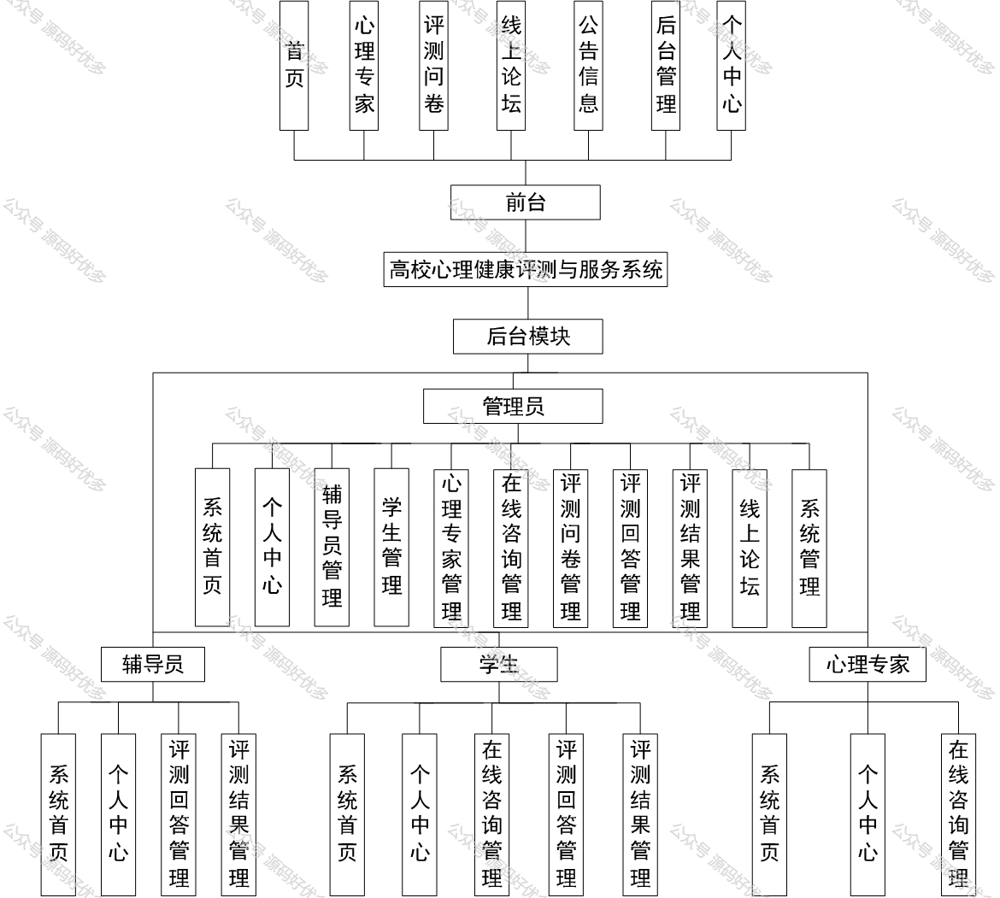
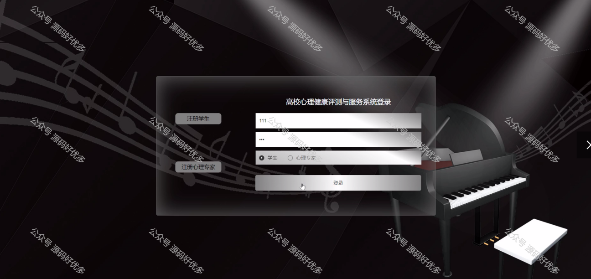
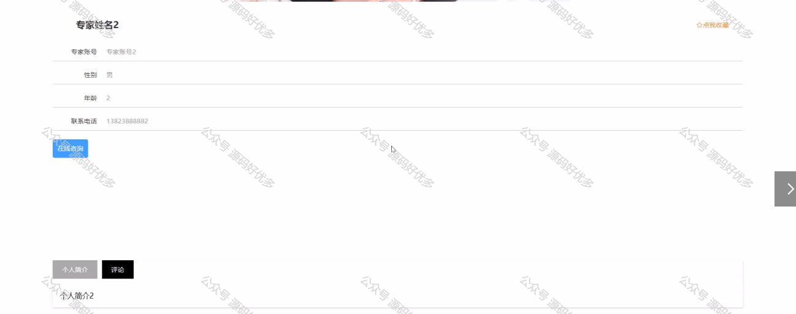
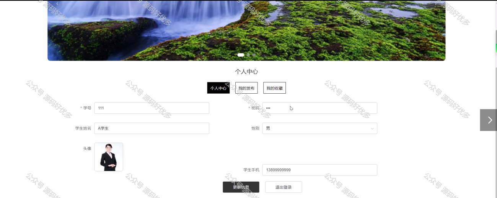
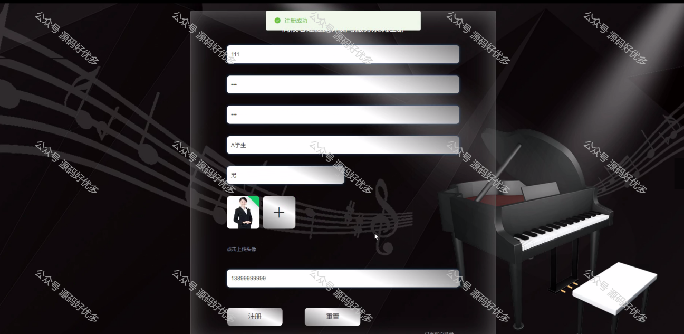
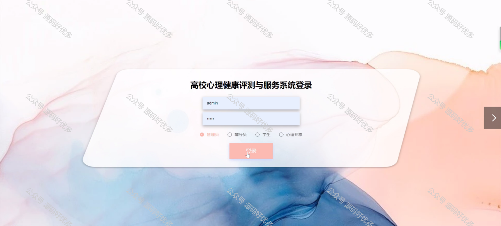
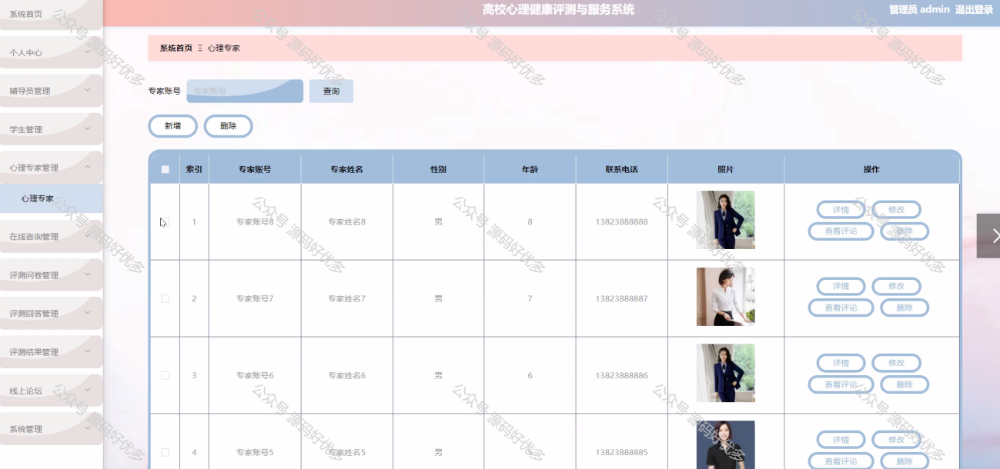
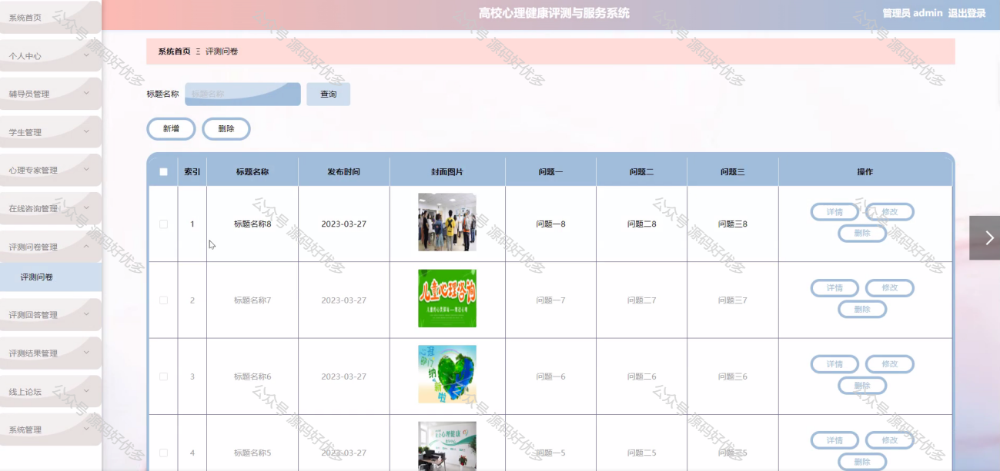
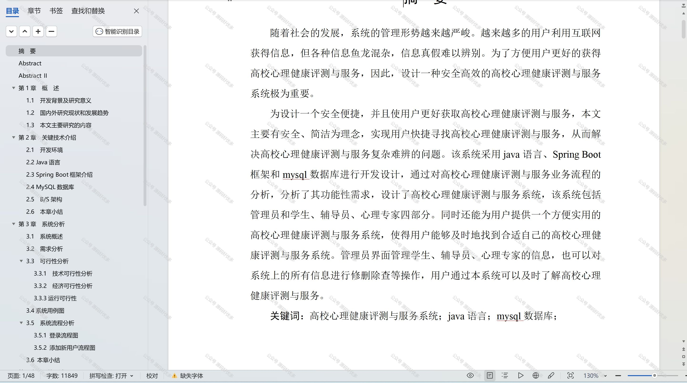

 
## 查看主页获取源码

### 一、作品包含

源码+数据库+设计文档万字+PPT+全套环境和工具资源+部署教程

### 二、项目技术

前端技术：Html、Css、Js、Vue、Element-ui

数据库：MySQL

后端技术：Java、Spring Boot、MyBatis

  

### 三、运行环境

开发工具：IDEA/eclipse

数据库：MySQL5.7

数据库管理工具：Navicat10以上版本

环境配置软件： JDK1.8+Maven3.6.3

前端Nodejs：14

### 四、项目介绍
项目编号：springbootA173

高校心理健康评测与服务系统是为了应对当前大学生心理健康问题的普遍性和紧迫性，提高心理健康教育与服务的效率和质量而开发的。系统以高校为背景，紧密结合大学生心理健康教育与服务的实际需求，旨在为学校提供一个科学、全面、便捷的心理健康评测与服务平台，以帮助学生及时发现和解决心理问题，促进学生心理健康水平的提高，营造积极健康的校园氛围。

前台学生功能：首页、心理专家、评测问卷、线上论坛、公告信息、后台管理、个人中心。

后台分为管理员、学生、辅导员、心理专家
管理员的功能：系统首页、个人中心、辅导员管理、学生管理、心理专家管理、在线咨询管理、评测问卷管理、评测回答管理、评测结果管理、线上论坛和系统管理。
学生的功能：系统首页、个人中心、在线咨询管理、评测回答管理、评测结果管理。
辅导员的功能：系统首页、个人中心、评测回答管理、评测结果管理。
心理专家的功能：系统首页、个人中心、在线咨询管理。

### 五、运行截图

  
